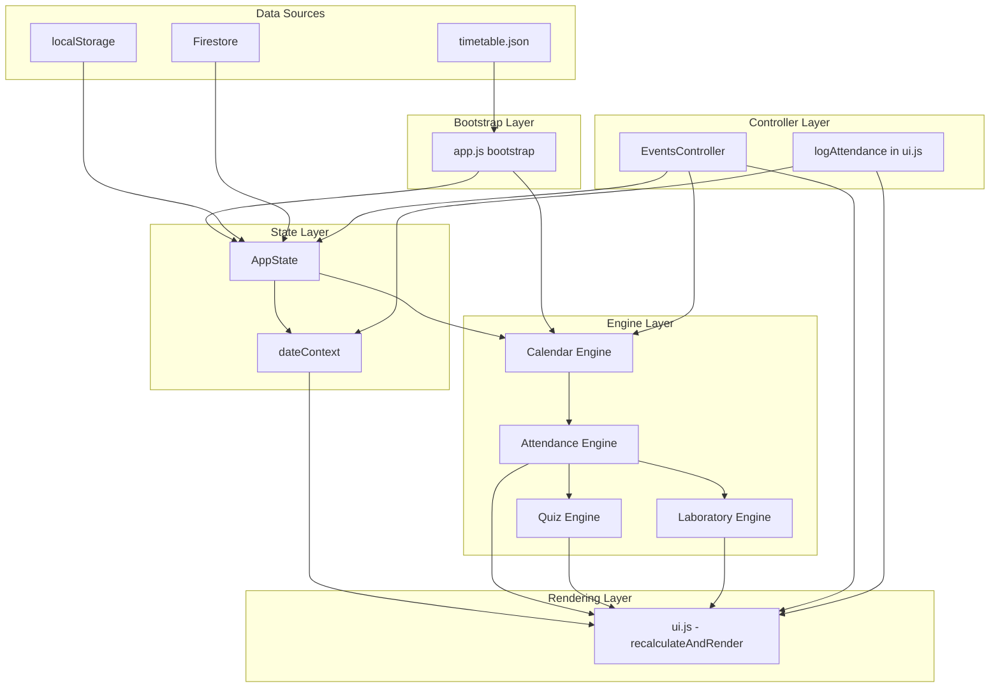

# 04 — Complete Architecture

## Architectural Philosophy

The architecture is a **strict layered engine architecture** with clear data ownership, unidirectional data flow, and a single unified render pipeline. Every design decision enforces one principle: **no duplicated business logic anywhere in the codebase**.

---

## Layer Diagram



---

## Unidirectional Data Flow

```
User Action
    ↓
Controller (EventsController or logAttendance)
    ↓
State Mutation (AppState or dateContext)
    ↓
Persistence (localStorage + Firestore via triggerCloudSync)
    ↓
recalculateAndRender()
    ↓
Engine Pipeline (Calendar → Attendance → Quiz → Lab)
    ↓
DOM Update
```

This flow is **always** followed. No exceptions. The UI never mutates state directly or calls engine functions independently.

---

## Engine Architecture

### Dependency Order

```
timetable.json (raw data)
    ↓
utils.js (CLASS_TYPES, getMergedDaySchedule)
    ↓
calendar-engine.js (AcademicDay, windows, event deltas)
    ↓
attendance-engine.js (counts, optimization)
    ↓
quiz-engine.js (eligibility from Attendance Engine results)
    ↓
laboratory-engine.js (independent, uses only utils.js)
```

Each engine only imports from layers below it. No circular imports.

### Engine Data Ownership

| Engine | Owns | Does NOT Own |
|---|---|---|
| Calendar Engine | Working days, holidays, quiz windows, attendance windows, event resolution, event priority | Attendance counts, optimization, eligibility |
| Attendance Engine | All attendance math: current %, forecast %, optimization, must-attend counts, safe skips | Dates, quiz dates, eligibility rules |
| Quiz Engine | Eligibility determination per subject per quiz cycle | Attendance calculation (delegates to Attendance Engine) |
| Laboratory Engine | Lab experiment tracking, milestone evaluation | Regular attendance, quiz eligibility |

---

## Module Boundaries

### Strict Rules (Never Violate)

1. **`ui.js` imports from engines — engines do NOT import from `ui.js`** (except `events-controller.js` which must call `recalculateAndRender` after mutations — this is the single allowed reverse reference and is intentional).
2. **`calendar-engine.js` has no imports** (aside from no external dependencies). It is a pure, self-contained temporal authority.
3. **`attendance-engine.js` does not import `quiz-engine.js`** or any UI layer.
4. **`app.js` is the only file that imports from all other modules**.
5. **`storage.js` does not import engine modules**. It owns the data layer only.

---

## State Architecture

### `AppState` (in `storage.js`)

The single global state object. Not a reactive store — it is a plain JavaScript object.

```javascript
export const AppState = {
  profile: {},           // { name, rollNumber, createdAt }
  attendance: {},        // { "YYYY-MM-DD:CODE:TYPE": "Attended|Missed" }
  laboratory: {},        // { "CODE": LabExperiment[] }
  history: [],           // Reserved — not actively used
  settings: { theme: 'dark', simulationMode: false },
  academicEvents: {},    // { "YYYY-MM-DD": AcademicEvent[] }
  isDirty: false
};
```

**Rules**:
- `attendance` is keyed by class IDs: `"YYYY-MM-DD:SUBJ_CODE:TYPE"`.
- `academicEvents` is date-indexed (not flat array) for O(1) lookups by date.
- No module mutates `AppState` directly in a one-off manner — all mutations go through dedicated functions.

### `dateContext` (in `dateContext.js`)

A secondary state object governing which date is being viewed and whether the app is in live or simulation mode.

```javascript
export const dateContext = {
  selectedDate: getTodayString(), // YYYY-MM-DD string
  mode: MODE.LIVE,                // 'LIVE' or 'SIMULATION'
  simulationAttendance: {}        // Temporary overlay, never persisted
};
```

**Rules**:
- `selectedDate` is always a `YYYY-MM-DD` **string** (never a `Date` object).
- Mode is derived automatically from `selectedDate` vs. today. Never set manually.
- Simulation attendance is always discarded when returning to LIVE mode.

---

## Rendering Pipeline

### `recalculateAndRender()` in `ui.js`

This is the **single master refresh function**. Every state change triggers this function. It:

1. Reads `getEffectiveStates()` from `dateContext` (live or simulation attendance).
2. Reads `getTimetable()` from `utils.js`.
3. For each quiz tab:
   - Calls `getAttendanceData(quizDate, states)` from `attendance-engine.js`.
   - Calls `computeSubjectStats()` for each subject.
   - Calls `computeOverallStats()` for the dashboard summary.
   - Calls `computeQuizDashboard()` from `quiz-engine.js`.
   - Calls `computeLaboratoryDashboard()` from `laboratory-engine.js`.
4. Builds the full HTML via component builder functions.
5. Injects into the correct DOM containers.
6. Calls `renderTodayClasses()` for today's class log.
7. Calls `renderAcademicEvents()` for the events view.

---

## Storage Pipeline

```
User Writes Attendance
    ↓
logAttendance() in ui.js
    ↓
logClassState() in dateContext.js
    ↓
if LIVE: saveStates() in storage.js → AppState.attendance updated
    ↓
persistLocalState(uid) → localStorage.setItem(...)
    ↓
triggerCloudSync() → 1000ms debounce → Firestore set({ merge: true })
```

---

## Calendar Pipeline

```
Bootstrap (app.js)
    ↓
initCalendarEngine(calendarData) → L1 static cache frozen
    ↓
syncRuntimeEvents(AppState.academicEvents) → runtime events loaded
    ↓
getAcademicDay(dateString)
    → resolves events for date
    → applies priority-based conflict resolution
    → returns immutable AcademicDay (cached in L2 memory)
    ↓
getQuizWindow(subjectCode, quizCycle)
    → finds quiz milestone in subject timeline
    → computes effective teaching dates
    → returns AttendanceWindow
```

---

## Academic Event Pipeline

```
User Creates Event via Form
    ↓
handleEventFormSubmit() in app.js
    ↓
createAcademicEvent() in events-controller.js
    ↓
validateAcademicEvent() in calendar-engine.js
    ↓
uniqueness check in AppState.academicEvents
    ↓
addAcademicEvent() in calendar-engine.js → L2 cache cleared
    ↓
AppState.academicEvents[date].push(event)
    ↓
persistLocalState() + triggerCloudSync()
    ↓
recalculateAndRender() → event appears in UI
```

---

## Bootstrap Sequence

```
1. DOM ready (DOMContentLoaded)
2. app.js module loads
3. initDOMBindings() — attach all event listeners
4. bootstrap() called
   a. initTimetable() — fetch timetable.json, parse
   b. buildSubjectTimelines() — derive timelines from timetable data
   c. initCalendarEngine(calendarData) — initialize L1 cache
   d. syncRuntimeEvents(AppState.academicEvents) — load runtime events
   e. updateThemeBtn() — apply persisted theme
5. auth.onAuthStateChanged() listener registered
6. On user login:
   a. initLocalState(uid) — hydrate AppState from localStorage
   b. applyTheme(), updateProfileUI()
   c. recalculateAndRender() — first render with local data
   d. fetchCloudStates() — background cloud sync
   e. If cloud changed: applyTheme(), updateProfileUI(), recalculateAndRender()
   f. checkProfileRecovery() — show recovery modal if profile incomplete
   g. checkMigration() — show migration modal if legacy V1 data exists
```

---

## Desktop vs Mobile Rendering

`recalculateAndRender()` uses `window.innerWidth <= 768` to detect mobile viewport and branches:

- **Desktop**: Renders hero card + quiz table + lab section + full statistics table per tab.
- **Mobile**: Renders compact attendance cards for the dashboard panel; subject accordion cards are injected into `#subjectsViewContent` separately.

The underlying engine calculations are **identical** regardless of viewport. Only the HTML template functions differ.
