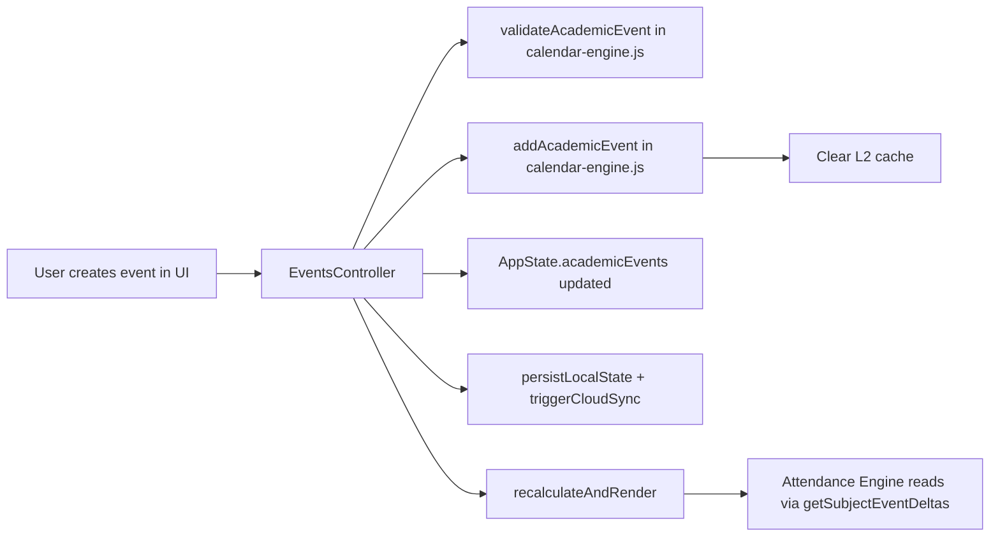

# 09 — Academic Event System

**Files**: `js/calendar-engine.js` (registry + engine), `js/events-controller.js` (controller)  
**Status**: ✅ Backend complete. UI implemented but awaiting full browser validation.

---

## Purpose

The Academic Event System provides a runtime layer for user-defined academic events that affect the attendance calculation. These are events beyond the pre-declared institutional calendar — things like a specific professor announcing an extra lecture, a class getting cancelled, or an unscheduled quiz.

Every future feature that modifies the academic schedule (extra classes, holidays, cancelled classes, surprise quizzes) must be built on this system. No parallel event systems should ever exist.

---

## Architecture



---

## AcademicEvent Domain Model

```javascript
{
  id: string,             // 'evt_' + random + timestamp (generated by controller)
  version: number,        // Starts at 1, incremented on edit
  eventType: string,      // Key from AcademicEventRegistry
  subjectCode: string|null, // null for global events (holidays, emergency)
  classType: string|null,   // null if not applicable
  effectiveDate: string,  // YYYY-MM-DD
  metadata: {},           // Free-form metadata object
  createdAt: string,      // ISO timestamp
  source: 'USER',         // Origin (always 'USER' for now)
  active: boolean,        // false = disabled (not counted in engine)
  archived: boolean,      // true = soft-deleted
  history: [              // Immutable audit trail
    { action: string, timestamp: string, user: string }
  ]
}
```

### Lifecycle States

```
Active (active: true, archived: false)
    ↓ toggleAcademicEvent(false)
Disabled (active: false, archived: false)
    ↓ archiveAcademicEventController()
Archived (active: false, archived: true)
```

**Permanent deletion does not exist in normal user flows.** Archived events remain in `AppState.academicEvents` and Firestore but are not counted by the engine.

---

## Storage Structure

Events are stored date-indexed in `AppState.academicEvents`:

```javascript
AppState.academicEvents = {
  "2026-08-10": [AcademicEvent, AcademicEvent, ...],
  "2026-08-15": [AcademicEvent, ...],
  ...
}
```

Date-indexing was a deliberate Phase F1.2 architectural decision for O(1) date-based lookups and efficient calendar rendering.

---

## AcademicEventRegistry

Defined in `calendar-engine.js` (exported). Every valid event type must have an entry:

```javascript
{
  displayName: string,       // Human-readable name for UI
  icon: string,              // Icon identifier (SVG path name)
  color: string,             // Color category (blue, red, purple, orange)
  requiresSubject: boolean,  // Whether the event must be linked to a subject
  requiresClassType: boolean,// Whether the event must specify a class type
  allowedClassTypes: string[]// Valid class types for this event
}
```

The registry drives:
1. `validateAcademicEvent()` — validates event data against registry rules.
2. UI form generation — `openEventForm()` in `app.js` dynamically builds form fields based on registry.
3. UI card rendering — `renderAcademicEvents()` in `ui.js` reads registry for colors and badges.

---

## EventsController (`js/events-controller.js`)

The controller is the **exclusive interface for event mutations**. The UI never calls Calendar Engine functions directly to mutate events.

### Common Pipeline

Every mutation goes through `processEventMutation(fn)`:

```javascript
function processEventMutation(mutationFn) {
  try {
    mutationFn();
    AppState.isDirty = true;
    persistLocalState(auth.currentUser.uid);
    triggerCloudSync();
    recalculateAndRender();
    return { success: true };
  } catch (err) {
    return { success: false, error: err.message };
  }
}
```

### Functions

#### `createAcademicEvent(rawEvent)`

1. `validateAcademicEvent(rawEvent)` — throws on invalid.
2. Uniqueness check: no active event with same type/date/subject/classType.
3. Assigns `id`, `version: 1`, timestamps, `source: 'USER'`, `active: true`, `archived: false`.
4. Calls `addAcademicEvent(newEventData)` in Calendar Engine (adds to `runtimeEvents`, clears L2).
5. Pushes to `AppState.academicEvents[date]`.
6. Triggers common pipeline.

#### `updateAcademicEvent(updatedRawEvent, originalDate)`

1. `validateAcademicEvent(updatedRawEvent)`.
2. Appends `Edited` history entry.
3. If date changed: removes from old date, archives in Calendar Engine.
4. Calls `addAcademicEvent(updatedRawEvent)` to update in-memory.
5. Updates `AppState.academicEvents[date][idx]`.
6. Triggers common pipeline.

#### `toggleAcademicEvent(eventId, dateString, isActive)`

1. Finds event in `AppState.academicEvents[dateString]`.
2. Appends `Enabled` or `Disabled` history entry.
3. Creates updated event with `active: isActive`.
4. Calls `addAcademicEvent(updatedRawEvent)` to update in-memory.
5. Triggers common pipeline.

#### `archiveAcademicEventController(eventId, dateString)`

1. Finds event in `AppState.academicEvents[dateString]`.
2. Calls `archiveAcademicEvent(eventId, dateString)` in Calendar Engine.
3. Updates `AppState.academicEvents[dateString][idx]` with archived event.
4. Triggers common pipeline.

---

## How Events Affect Attendance Calculations

The Calendar Engine's `getSubjectEventDeltas(dateString, subjectCode, classType)` function is called by the Attendance Engine for every teaching day in every window. It returns an integer delta:

| Event Type | Delta |
|---|---|
| `EXTRA_LECTURE` | +1 to L |
| `EXTRA_TUTORIAL` | +1 to T |
| `EXTRA_PRACTICAL` | +1 to P |
| `SURPRISE_QUIZ` | +1 (lecture or tutorial) |
| `CLASS_CANCELLED` | -1 to the relevant type |
| `EMERGENCY_CLOSURE` / `PUBLIC_HOLIDAY` / `INSTITUTE_HOLIDAY` | 0 (day is not working — handled upstream by `getAcademicDay`) |

**Important**: High-priority closure events (EMERGENCY_CLOSURE, PUBLIC_HOLIDAY, INSTITUTE_HOLIDAY, FESTIVAL_HOLIDAY, SEMESTER_BREAK) return `0` delta because they affect `isWorkingDay` — the teaching day is simply not counted in the window at all.

---

## UI Components (Partially Implemented)

### Events View (`#eventsView` in `index.html`)

- Located in the `profileView` → Academic Tools section.
- Tab filter: "Active" / "Archived".
- `#eventsList` container populated by `renderAcademicEvents()` in `ui.js`.
- New Event button: `#btnNewEvent`.

### Event Form (Bottom Sheet `#eventFormSheet`)

- Opened by `openEventForm()` in `app.js`.
- Dynamically generated HTML based on `AcademicEventRegistry`.
- Fields: event type (select), effective date (date input), subject (select, if required), class type (select, if required).
- Submission: `handleEventFormSubmit()` in `app.js`.

---

## Known Issues

1. **Firestore rules do not allow `academicEvents` field**: The current `firestore.rules` `isValidStudentDoc()` function restricts root fields to `['attendance', 'settings', 'profile']` (line 48). `academicEvents` and `laboratory` writes will fail server-side validation. **This is a critical bug that blocks cloud sync for events.**
2. **Duplicate state between `AppState.academicEvents` and `runtimeEvents`**: The controller writes to `AppState.academicEvents` and calls `addAcademicEvent()` which writes to the Calendar Engine's internal `runtimeEvents`. On app restart, `syncRuntimeEvents(AppState.academicEvents)` re-syncs them. But there is a potential for inconsistency if the controller and engine fall out of sync mid-session.
3. **Form UI not fully validated in browser**: The complete CRUD flow (create, edit, toggle, archive) has been implemented in code but hasn't been fully validated in a live browser session due to a series of test-blocking issues (cache, service worker, browser subagent errors).
