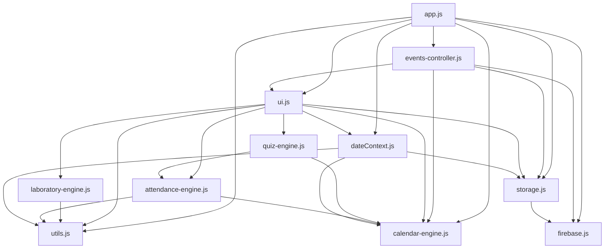
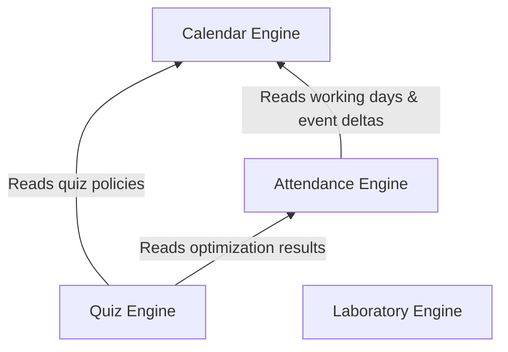

# 19 — Dependency Graph

This document outlines the strict dependency rules that govern the AttendanceDash Pro architecture. Violating these rules will introduce circular dependencies or break the unidirectional data flow.

---

## 1. Allowed Module Dependency Graph

This diagram shows the **only permitted import paths** between JavaScript modules. A solid arrow from A to B means A imports from B.

---

## 2. Engine Layering Rules

The four core engines follow a strict vertical hierarchy. An engine may only import from engines *below* it.

### Forbidden Engine Imports
- 🚫 `calendar-engine.js` **MUST NOT** import any other engine. It is the absolute bottom layer.
- 🚫 `attendance-engine.js` **MUST NOT** import `quiz-engine.js` or `laboratory-engine.js`.
- 🚫 `laboratory-engine.js` **MUST NOT** import `attendance-engine.js`. (It reads physical attendance state passed as a raw argument, not via import).
- 🚫 **NO ENGINE** may import from `ui.js`, `app.js`, `storage.js`, or `events-controller.js`.

---

## 3. Circular Dependency Prevention

To prevent circular dependencies, adhere to the following rules:

### The Single Reverse Import Exception
`events-controller.js` is allowed to import `recalculateAndRender` from `ui.js`. This is necessary because mutations must trigger a UI refresh. `ui.js` does **not** import `events-controller.js`. (Event listeners for controller actions are bound in `app.js`).

### State Passing Instead of State Importing
Engines do not import `storage.js` to read `AppState`. Doing so would couple the engine to the storage layer and prevent simulation mode testing. Instead, the UI reads `AppState` (or the simulated state from `dateContext`) and passes it into the engine functions (e.g., `getAttendanceData(quizDate, states)`).

### Utilities Are Leaf Nodes
`utils.js` must remain a leaf node. It cannot import from any other module. If a utility function requires business logic, it belongs in an engine, not in `utils.js`.

---

## 4. External Dependencies

| Dependency | Purpose | How Loaded |
|---|---|---|
| Firebase App (v10.7.1) | Core SDK | `<script>` tag (CDN) |
| Firebase Auth (v10.7.1) | Authentication | `<script>` tag (CDN) |
| Firebase Firestore (v10.7.1)| Database | `<script>` tag (CDN) |
| Google Fonts | Typography (Inter) | `<link>` tag (CDN) |

**Rule**: Do not add npm packages for runtime behavior. External dependencies must be zero-build and loaded via CDN.
