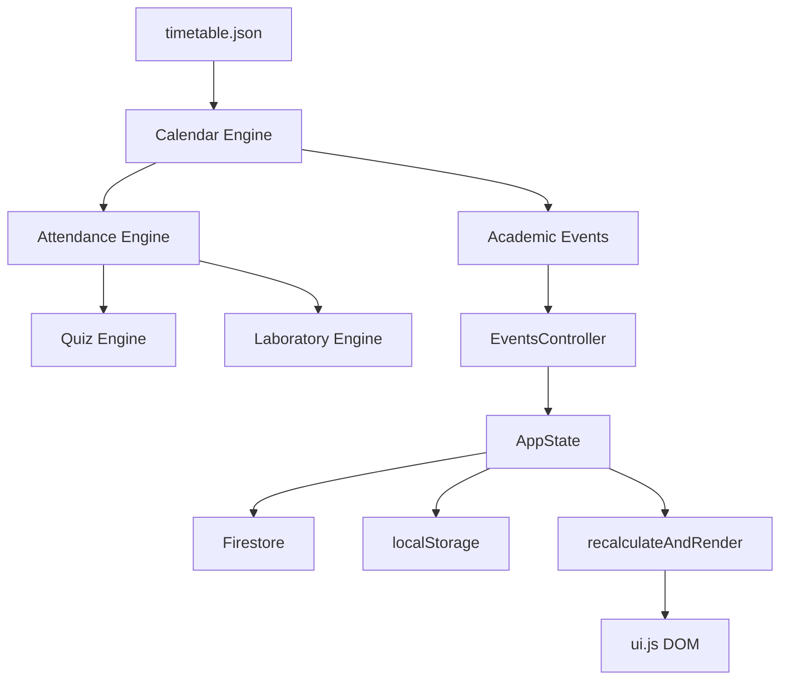

# AttendanceDash Pro — Project Bible & AI Developer Handoff

This directory contains the permanent technical reference for AttendanceDash Pro.

It is written for **AI agents and human developers** who need to continue work on this project with minimal context loss.

---

## Document Index

| Doc | Title | Contents |
|---|---|---|
| [00](00_EXECUTIVE_SUMMARY.md) | Executive Summary | Vision, maturity, goals |
| [01](01_PROJECT_OVERVIEW.md) | Project Overview | Target platform, design philosophy, scalability |
| [02](02_TECH_STACK.md) | Technology Stack | Firebase, PWA, SDK strategy, module graph |
| [03](03_FOLDER_STRUCTURE.md) | Folder Structure | Every file explained, purpose, ownership |
| [04](04_ARCHITECTURE.md) | Complete Architecture | Layer diagram, data flow, bootstrap sequence |
| [05](05_CALENDAR_ENGINE.md) | Calendar Engine | API, domain models, event priority, known limits |
| [06](06_ATTENDANCE_ENGINE.md) | Attendance Engine | Optimizer algorithm, API, internal structure |
| [07](07_QUIZ_ENGINE.md) | Quiz Engine | Eligibility rules, domain models, policy resolution |
| [08](08_LABORATORY_ENGINE.md) | Laboratory Engine | Lab experiments, milestones, storage format |
| [09](09_ACADEMIC_EVENT_SYSTEM.md) | Academic Event System | Registry, controller, lifecycle, storage, known issues |
| [10](10_STORAGE_AND_SYNC.md) | Storage and Synchronization | AppState, localStorage, Firestore sync, known issues |
| [11](11_UI_ARCHITECTURE.md) | UI Architecture | recalculateAndRender, component builders, rendering rules |
| [12](12_PWA_AND_DEPLOYMENT.md) | PWA and Deployment | Service worker, caching, manifest, install flow |
| [13](13_CODING_STANDARDS.md) | Coding Standards | Naming, module rules, engine rules, CSS conventions |
| [14](14_TESTING_AND_QA.md) | Testing and QA | Unit tests, AST validation, Puppeteer, manual QA |
| [15](15_KNOWN_BUGS_AND_TECHNICAL_DEBT.md) | Known Bugs and Technical Debt | All confirmed bugs and design debt |
| [16](16_ROADMAP.md) | Product Roadmap | Immediate priorities, near-term, medium-term, long-term |
| [17](17_AI_HANDOFF.md) | AI Developer Handoff | Architectural invariants, pitfalls, how to add features |
| [18](18_ARCHITECTURE_DECISION_RECORDS.md) | Architecture Decision Records | Chronological log of major architectural choices |
| [19](19_DEPENDENCY_GRAPH.md) | Dependency Graph | Module dependencies, rules, and allowed imports |
| [20](20_DATA_DICTIONARY.md) | Data Dictionary | Persistent data structures, lifecycles, ownership |
| [21](21_CHANGELOG.md) | Changelog | Evolution across major phases and feature additions |
| [22](22_AI_WORKING_CONTEXT.md) | AI Working Context | Permanent working mindset, rules, and philosophy for future AI |

---

## Quick Start for the Next Developer

1. **Read [17 — AI Handoff](17_AI_HANDOFF.md) first.** It contains the invariants you must not violate.
2. **Fix the two critical bugs** in [15 — Known Bugs](15_KNOWN_BUGS_AND_TECHNICAL_DEBT.md) (BUG-001 Firestore rules, BUG-002 service worker cache) before starting new feature work.
3. **Complete Phase F1.3 browser validation** — test the Academic Event CRUD flow in a browser.
4. **Start new features from the Roadmap** — [16 — Roadmap](16_ROADMAP.md) has a prioritized list.

---

## Architecture in One Diagram

---

## Application Version

**Current**: `2.0.2`  
**Current Phase**: F1.3 — Academic Event Management System (code-complete, pending browser validation)
